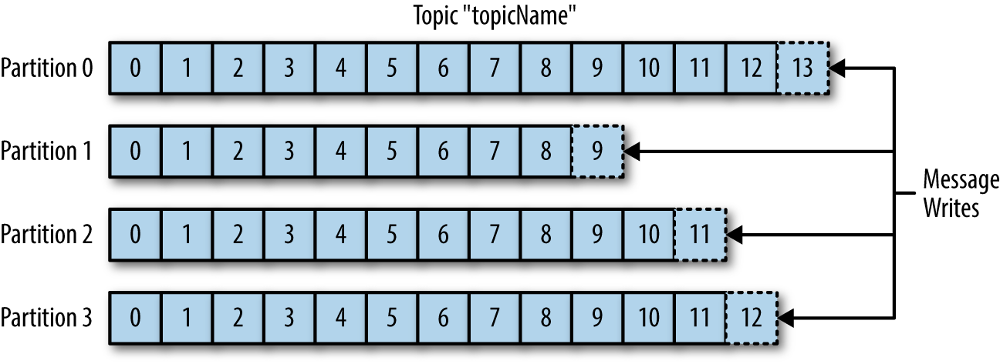

slidenumbers: false


# Kafka<sub>1883 - 1924</sub>

# In a **Nutshell**


---

[.background-color: #FFFFFF]


^Kommunikation zum Daten senden, bspw MOnitoring
Daten sammeln, auswerten, neue Daten generieren

---

[.background-color: #FFFFFF]


^
Immer mehr services kommen dazu
immer mehr Verbindungen werden gezogen

---

[.background-color: #FFFFFF]


^
Technical-Debt wird zurückgezahlt
Single Service to provide infos is built
Pubsub messaging system is born
no direct sender/receiver

---

[.background-color: #FFFFFF]


^
Andere machen das gleiche, schon wirds wieder komplex
Multiple Systems support
what you want single centralized system that allows for publishing generic types of data, which will grow as your business grows

---

[.header: #FFFFFF]
## Meet **Kafka**


^
Message Broker / Streaming Platform zum Verteilen von Nachrichten
Sind persistent, geordnet und append-only
distributed commit log / distributing streaming platform
used by Spotify, Uber, Robinhood, Netflix, Sony

---

## producers **produce**

## consumers **consume**

### in large *distributed* reliable

### way and *realtime*

^
Im groben macht Kafka das


---

## **Topics** and 
## **Partitions**
## in Kafka

^
topics like a table in DBs
partitions is for redundancy, like shards in ES

---

## **Messages** in Kafka
### **~1 million** messages/s

^
data within Kafka is called a message
like a record in a DB
single producer / consumer
schema possible
no limits for data
size configurable

---

[.header: #FFFFFF]
## The core of Kafka
## is the **Log**


---

### The *log* is simply a **time-ordered**, **append-only** sequence of data *inserts* where the *data* can be *anything*

---

[.background-color: #FFFFFF]


^
Bild von Topic
earliest, latest

---

[.background-color: #FFFFFF]


^
Partitions sind eigentliches log
beliebig erweitern aber nicht kleiner machen
verschiedene wege, das zu steuern
was bedeutet das für ordering?
ordering ist also nur in Partition gegeben!

---

[.background-color: #FFFFFF]
# **1** Consumer from **1** group


^
wenn nur 1 consumer, dann übernimmt er alle partitionen

---

[.background-color: #FFFFFF]
# **2** Consumers from **1** group


^
2 consumer teilen sich rein

---

[.background-color: #FFFFFF]


---

[.background-color: #FFFFFF]
# **4** Consumers from **1** group


^
ab 4 consumern hat jede partition einen consumer
aber was passiert danach?

---

[.background-color: #FFFFFF]
# **5** Consumers from **1** group


^
consumer ist idle und bekommt keine nachrichten
wichtig für partitionen, können nur erweitert aber nicht reduziert werden

---

[.background-color: #FFFFFF]
# **2** Consumer groups


^
rebalancing when consumer gets added or removed
analogie zu subscriber
bspw versch. services

---

[.header: #FFFFFF]
## Where will it go?


---

## when nothing is specified, **round robin** behaviour is used

---

## when only a **key** is specified, partition is choosen based on 
## **hash of the key**

---

## If a valid **partition number** is specified, that **partition** will be used

---

[.header: #FFFFFF]
## **Redundancy** in Kafka


---

[.background-color: #FFFFFF]


^
Leader distributed

---

## To tolerate **N** *failures*, you need **2N+1** *replicas*

---

[.header: #FFFFFF]

## **Costs** and **Infrastructure**


^
Downside von Kafka
kann man nicht gegen null laufen lassen
cloud und functions spielen einfacher zusammen
zookeeper

---

## **Alternatives** to Kafka

^
Amazon AWS Kinesis is a managed version of Kafka whereas I think of Google Pubsub as a managed version of Rabbit MQ. Amazon SNS with SQS is also similar to Google Pubsub (SNS provides the fanout and SQS provides the queueing).

---

## Customizable
## **Data Retention**

^
vorteile von Kafka
disk based retention, long duration
by time, messages, bytes
higher level aggregations
offsets erklären, laufen die nicht aus?
1TB/d -> 4 mio days

---

## Meet **KSQL**

```sql
CREATE TABLE pageviews_per_region_per_minute AS
  SELECT regionid,
         count(*)
  FROM pageviews_enriched
  WINDOW TUMBLING (SIZE 1 MINUTE)
  GROUP BY regionid
  EMIT CHANGES;
```

---

[.header: #FFFFFF]

## Any **Questions**?


