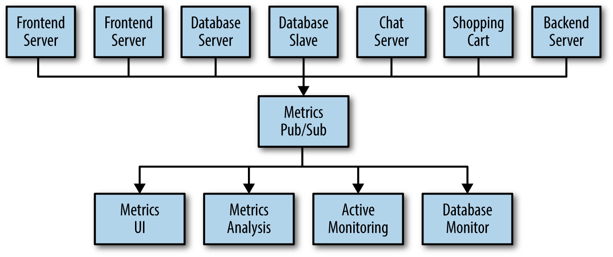
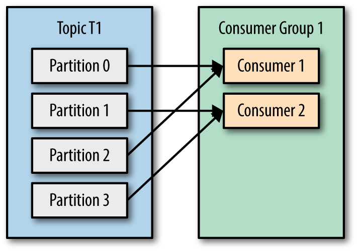
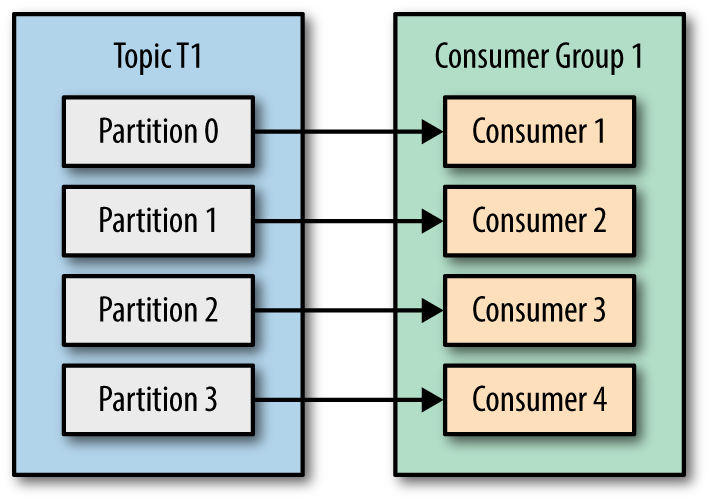
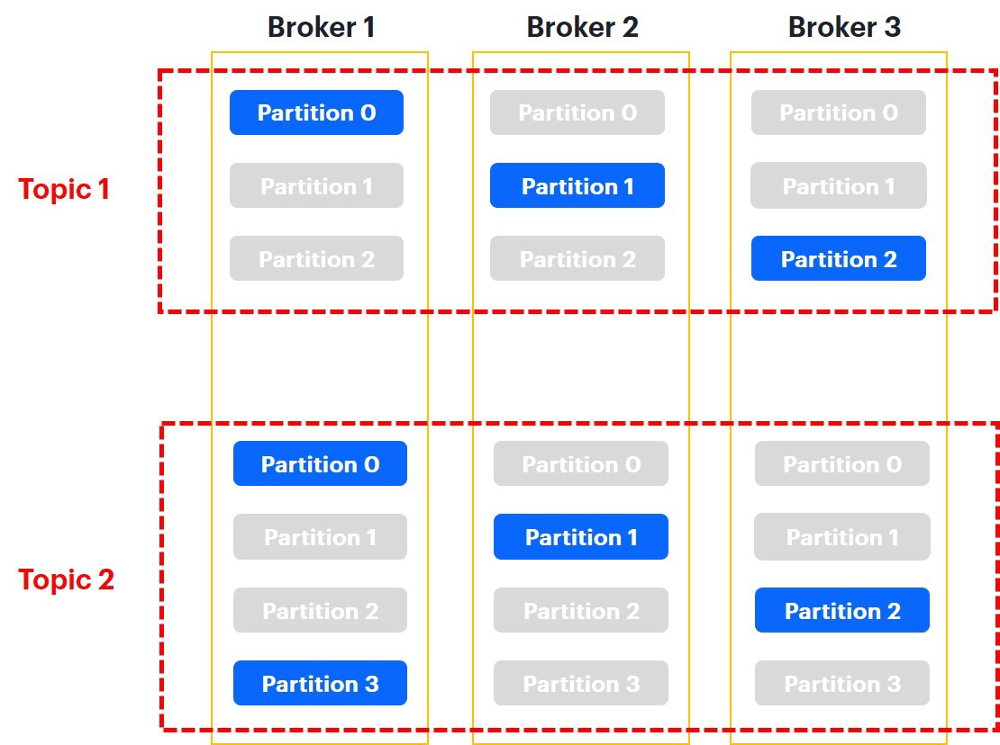

slidenumbers: false


# Kafka<sub>1883 - 1924</sub>

# In a **Nutshell**


---

[.background-color: #FFFFFF]


^offenkundig ein Experte

---

[.background-color: #FFFFFF]


^Kommunikation zum Daten senden, bspw MOnitoring
Daten sammeln, auswerten, neue Daten generieren

---

[.background-color: #FFFFFF]


^
Immer mehr services kommen dazu
immer mehr Verbindungen werden gezogen

---

[.background-color: #FFFFFF]


^
Technical-Debt wird zurückgezahlt
Single Service to provide infos is built
Pubsub messaging system is born
no direct sender/receiver

---

[.background-color: #FFFFFF]


^
Andere machen das gleiche, schon wirds wieder komplex
Multiple Systems support
what you want single centralized system that allows for publishing generic types of data, which will grow as your business grows

---

[.header: #FFFFFF]
## Meet **Kafka**


^
distributed commit log / distributing streaming platform
durable record of all transactions
replayed to consistently build the state of a system
data within Kafka is stored durably, in order, and can be read deterministically
used by Spotify, Uber, Robinhood, Netflix, Sony

---

## producers **produce**

## consumers **consume**

### in large *distributed* reliable

### way and *realtime*

^
Im groben macht Kafka das

---

## **Messages** in Kafka
### **~1 million** messages/s

^
data within Kafka is called a message
like a record in a DB
single producer / consumer
schema possible
no limits for data
size configurable

---

## **Topics** and 
## **Partitions**
## in Kafka

^
topics like a table in DBs
partitions is for redundancy, like shards in ES

---

[.header: #FFFFFF]
## The core of Kafka
## is the **Log**


---

### The *log* is simply a **time-ordered**, **append-only** sequence of data *inserts* where the *data* can be *anything*

---

[.background-color: #FFFFFF]


^
no acks
danach Demo Code,
auch UI zeigen
earliest, latest

---

## **Partitions** in Kafka

^
redundancy and scalability

---

[.background-color: #FFFFFF]


^
Partitions sind eigentliches log
beliebig erweitern aber nicht kleiner machen
verschiedene wege, das zu steuern
was bedeutet das für ordering?

---

## **Ordering** is **only** guaranteed **inside** a single **Partition** !!!11elf

---

[.background-color: #FFFFFF]
# **1** Consumer from **1** group


---

[.background-color: #FFFFFF]
# **2** Consumers from **1** group


---

[.background-color: #FFFFFF]


---

[.background-color: #FFFFFF]
# **4** Consumers from **1** group


^
aber was passiert danach?

---

[.background-color: #FFFFFF]
# **5** Consumers from **1** group


---

[.background-color: #FFFFFF]
# **2** Consumer groups


^
consumer groups share ownership of partitions
rebalancing when consumer gets added or removed
analogie zu subscriber
bspw versch. services

---

[.header: #FFFFFF]
## Where will it go?


---

## when nothing is specified, **round robin** behaviour is used

---

## when only a **key** is specified, partition is choosen based on 
## **hash of the key**

---

## If a valid **partition number** is specified, that **partition** will be used

---

## Log **Compacted** Topic

^
based on key
hold only latest message per key
demo

---

[.header: #FFFFFF]
## **Redundancy** in Kafka


---

[.background-color: #FFFFFF]


^
Leader distributed

---

## To tolerate **N** *failures*, you need **2N+1** *replicas*

---

## Why **not** Kafka?

---

[.header: #FFFFFF]

## **Costs** and **Infrastructure**


^
kann man nicht gegen null laufen lassen
cloud und functions spielen einfacher zusammen
zookeeper

---

## **Kafka** vs **PubSub**

^
Queue vs Message log
once its read its gone
- fully managed vs on premise
- dead-letters

---

## **Alternatives** to Kafka

^
Amazon AWS Kinesis is a managed version of Kafka whereas I think of Google Pubsub as a managed version of Rabbit MQ. Amazon SNS with SQS is also similar to Google Pubsub (SNS provides the fanout and SQS provides the queueing).

---

[.header: #FFFFFF]
## But **Why** Kafka?


---

## **Multiple** Producers
## and sources

^
einfach dranhängen und abschicken
start with one broker, scale out
start with one partition, scale out
can be done online
Sources über Kafka-connect

---

## **Multiple** Consumers
## and sinks

^
einfach dranhängen und abschicken
Sinks über Kafka-connect

---

## Customizable
## **Data Retention**

^
disk based retention, long duration
by time, messages, bytes
higher level aggregations
offsets erklären
1TB/d -> 4 mio days

---

## **Immutable** Datastore with **Replay** functionality

^
Ansätze wie CQRS = Command Query Responsibility Segregation
Event Sourcing
Stateless instances

---

## Meet **KSQL**

```sql
CREATE TABLE pageviews_per_region_per_minute AS
  SELECT regionid,
         count(*)
  FROM pageviews_enriched
  WINDOW TUMBLING (SIZE 1 MINUTE)
  GROUP BY regionid
  EMIT CHANGES;
```

---

[.header: #FFFFFF]

## Any **Questions**?


---

[.background-color: #FFFFFF]

## **Thanks** &&

#### At Least Once Delivery **Rulez**


